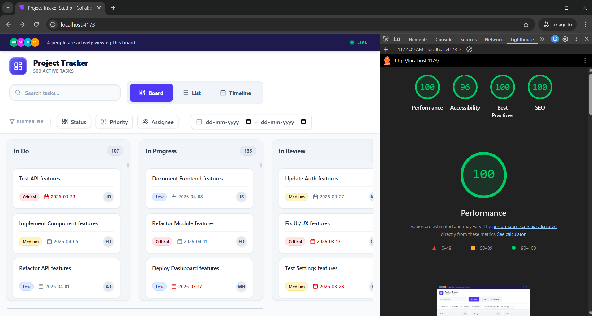

# 🚀 Project Tracker UI (Frontend Engineering Assessment)

A high-performance project management frontend application built using **React + TypeScript**.
This project demonstrates advanced frontend engineering concepts including custom drag-and-drop, virtual scrolling, multi-view architecture, and URL-synced state.

---

## 🔗 Live Demo

👉 project-tracker-p5tgg8msh-kshipra669-9440s-projects.vercel.app

## 📂 GitHub Repository

👉 https://github.com/Shiprakumari123/project-tracker

---

## 📸 Application Preview



---

## 🚀 Lighthouse Performance Report


**Scores:**

* Performance: 100
* Accessibility: 96
* Best Practices: 100
* SEO: 100

---

## 🛠️ Tech Stack

* React + TypeScript
* Zustand (State Management)
* Tailwind CSS
* Vite

---

## ✨ Features

### 📊 Multi-View System

* Kanban Board (To Do, In Progress, In Review, Done)
* List View (Sortable + Virtual Scrolling)
* Timeline View (Gantt-style visualization)

---

### 🧲 Custom Drag-and-Drop (No Libraries)

* Built using native browser events
* Smooth drag with visual feedback
* Placeholder handling to avoid layout shift
* Snap-back on invalid drop
* Works on mouse and touch devices

---

### ⚡ Virtual Scrolling (500+ Tasks)

* Renders only visible rows + buffer
* Maintains scroll height
* Smooth performance with no lag

---

### 🔍 Filters with URL Sync

* Multi-select filters (status, priority, assignee)
* Date range filtering
* URL query parameters sync
* Back navigation restores state

---

### 👥 Live Collaboration Simulation

* Simulated users moving across tasks
* Avatar indicators on task cards
* Real-time-like updates

---

## 📦 Data Handling

* Custom data generator for 500+ tasks
* Data persisted using localStorage

---

## ⚙️ Setup Instructions

```bash
git clone https://github.com/Shiprakumari123/project-tracker.git
cd project-tracker
npm install
npm run dev
```

---

## 🚀 Build & Preview

```bash
npm run build
npm run preview
```

---

## 🧠 Key Engineering Decisions

* Zustand used for simple and scalable global state
* Custom drag-and-drop for full control over UI behavior
* Virtual scrolling implemented manually for performance
* URL-based filters for shareable and bookmarkable state

---

## ⚠️ Constraints Followed

* No drag-and-drop libraries
* No virtual scrolling libraries
* No UI component libraries
* Built completely from scratch

---

## 🔮 Future Improvements

* Accessibility improvements (keyboard navigation)
* Backend integration for real-time collaboration
* Mobile responsiveness

---

## 👩‍💻 Author

**Shipra Kumari**

---

## 📌 Note

This project was developed as part of a frontend technical assessment focusing on performance, UI engineering, and scalable architecture.
